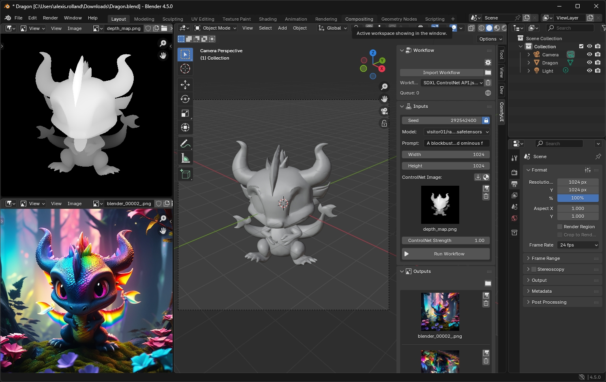
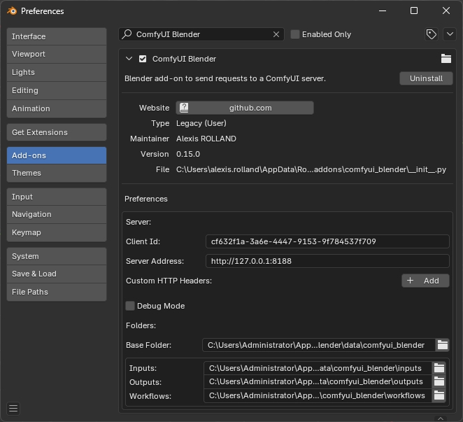
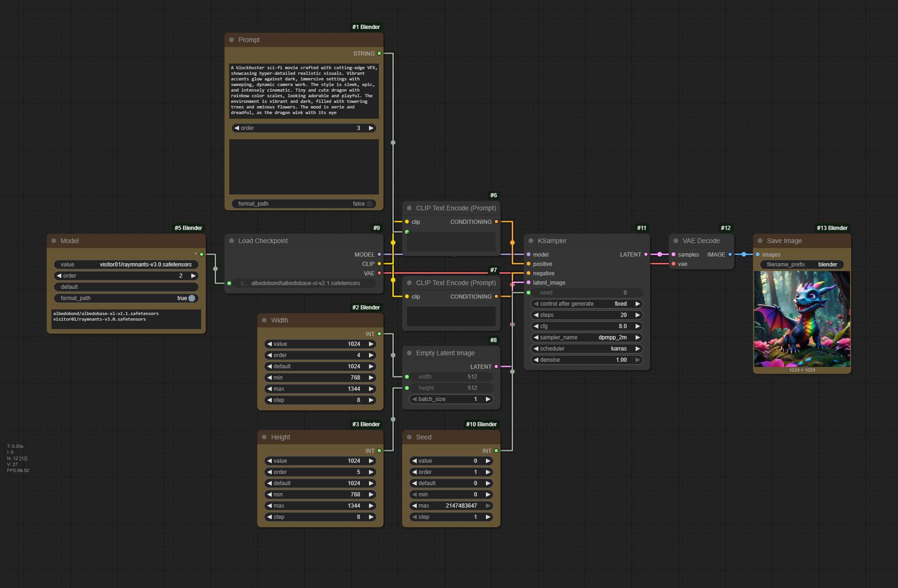

# ComfyUI-Blender

[](https://registry.comfy.org/nodes/comfyui-blender)
[](https://github.com/alexisrolland/ComfyUI-Blender/releases/latest)

This respository contains both custom nodes to be installed on the ComfyUI server and the Blender add-on to send workflows to the ComfyUI server. They can be used as follow:

* Create a workflow in ComfyUI **with the Blender nodes**.
* Run the workflow to confirm it executes properly.
* Export the workflow **in API format**.
* Import the workflow in the Blender add-on

The Blender add-on UI is automatically generated according to the input and output nodes used in the workflow.



## Getting Started

### Install ComfyUI Custom Nodes

> **Make you have the latest version of ComfyUI.**
> At the time of writing this, the latest version was ComfyUI `v0.3.57`. This version of ComfyUI required to update some of the ComfyUI-Blender nodes to the custom node schema v3. Making them incompatible with earlier versions of ComfyUI.

Install the custom nodes on your ComfyUI server. They can be installed from the ComfyUI Manager or by cloning this repository:

```shell
cd ./ComfyUI/custom_nodes
git clone https://github.com/alexisrolland/ComfyUI-Blender.git
```

If the ComfyUI server runs on a different machine than the Blender client, it must be started with the argument `--listen`. See ComfyUI documentation: [Setting Up LAN Access for ComfyUI](https://docs.comfy.org/installation/comfyui_portable_windows#2-setting-up-lan-access-for-comfyui-portable).

### Install Blender Add-on

Download the add-on package `comfyui_blender_[...].zip` from the **[LATEST RELEASE](https://github.com/alexisrolland/ComfyUI-Blender/releases)**.

In Blender, go to `Edit` > `Preferences` > `Add-ons` > `Install from Disk` > select the zip package.

Update the ComfyUI server address in the add-on preferences:



#### Remarks

> Ensure you have a recent version of Blender. The add-on has been developed for Blender `v4.5` and above. Some features such as the lineart rendering are not working properly on earlier versions.

## Usage

For complete details about the various features, refer to the **[DOCUMENTATION](https://github.com/alexisrolland/ComfyUI-Blender/wiki)**.

In a nutshell:

1. In ComfyUI, create a workflow using the Blender nodes (see workflow examples in this repository).

    * The Blender nodes are used to define the inputs and outputs to be displayed in the Blender add-on.
    * The title of the nodes are used as labels in the Blender add-on panel.



2. Run the workflow to confirm it executes properly.

3. Export the workflow JSON file **in API format**: Top Left Menu > `File` > `Export (API)`.

4. In Blender, import the workflow JSON file (make sure it is in API format): Press `N` > `ComfyUI` > `Import Workflow`.

4. Update the inputs and click on **Run Workflow**.
