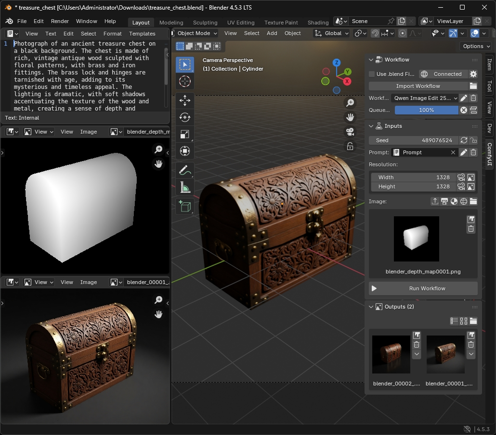
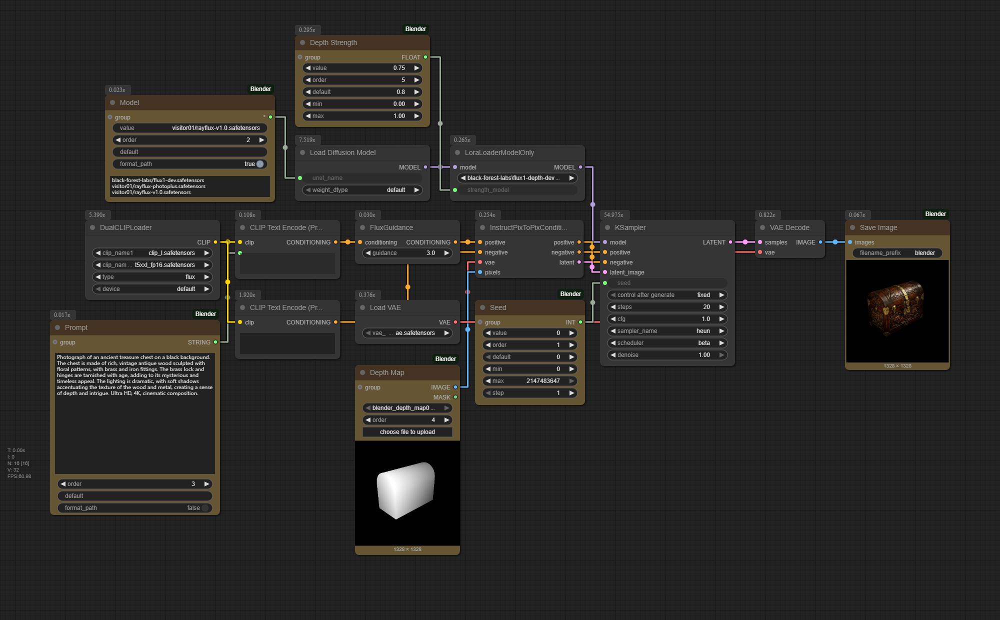

# ComfyUI Blender

[](https://registry.comfy.org/nodes/comfyui-blender)
[](https://github.com/alexisrolland/ComfyUI-Blender/releases/latest)

This respository contains both custom nodes to be installed on the ComfyUI server and the Blender add-on to send workflows to the ComfyUI server. 

* Create a workflow in ComfyUI **with the Blender nodes**.
* Export the workflow **in API format**.
* Import the workflow in the Blender add-on

The Blender add-on UI is automatically generated according to the input and output nodes used in the workflow.



## Getting Started

### Install ComfyUI Custom Nodes

Install the custom nodes on your ComfyUI server. They can be installed from the ComfyUI Manager or by cloning this repository:

```shell
cd ./ComfyUI/custom_nodes
git clone https://github.com/alexisrolland/ComfyUI-Blender.git
```

Note these nodes do not require additional Python dependencies. They are only used to define the inputs and outputs of the workflows to be displayed in the Blender add-on.

### Install Blender Add-on

Download the add-on package `comfyui_blender_[...].zip` from the **[LATEST RELEASE](https://github.com/alexisrolland/ComfyUI-Blender/releases)**.

In Blender, go to `Edit` > `Preferences` > `Add-ons` > `Install from Disk` > select the zip package.

## Usage

1. In ComfyUI, create a workflow using the Blender nodes (see workflow examples in this repository).

    * The Blender nodes are used to define the inputs and outputs to be displayed in the Blender add-on.
    * The title of the nodes are used as labels in the Blender add-on panel.



2. Export the workflow JSON file **in API format**: `Workflow` > `Export (API)`.

3. In Blender, import the workflow JSON file (make sure it is in API format): Press `N` > `ComfyUI` > `Import Workflow`.

4. Update the inputs and click on **Run Workflow**.

For more details about the various features and use cases, refer to the **[DOCUMENTATION](https://github.com/alexisrolland/ComfyUI-Blender/wiki)**.
